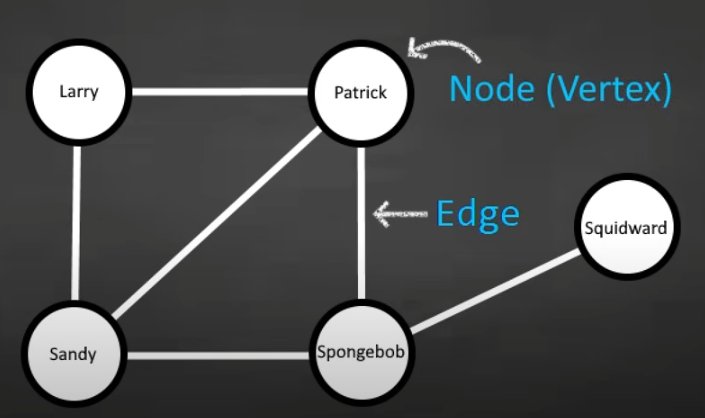
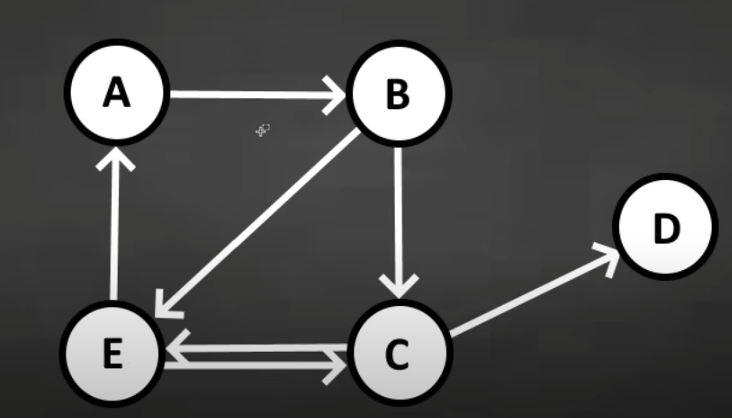
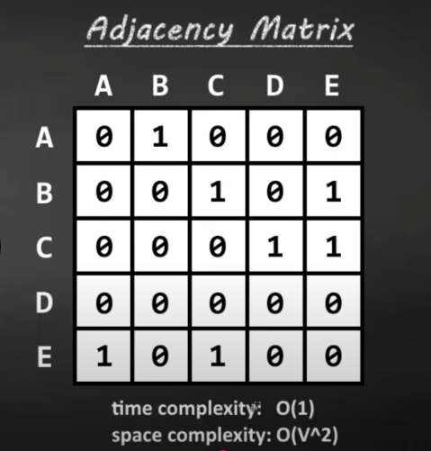
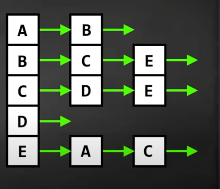

A node is something that contains data 

The Edge connects node within

when they are connected its called adjacency

there are also directed graphs

When using adjaceny, the most popular data sets are Adjacency Matrix and lists

