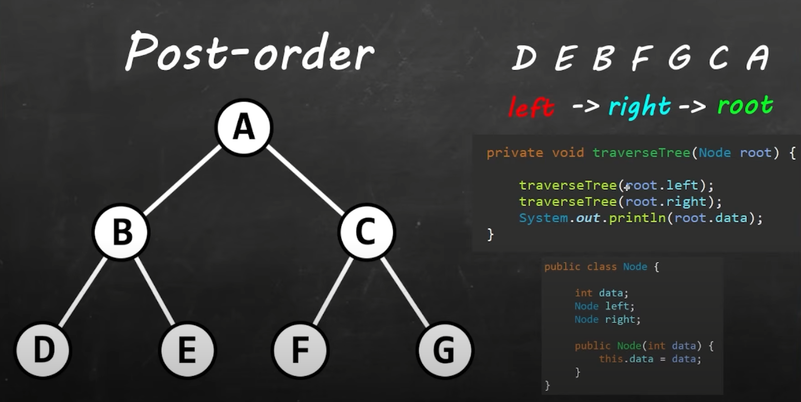

Tree traversal is the process of visiting all the nodes in a tree
We dont have random access, so we need to traverse through the tree.
There are 3 types of navigating through a tree:
1) In-Order
2) post-order
3) pre-order

We are working with a binary Tree, not a binary Search Tree because the nodes are not values in order

in-Order:
We go as far to the left as we can, then we go to root and after it we switch to right branch

post-Order:
It is used to delete leafs from a tree
We go as far to the left as we can, then we go to the right branch and after it we switch to root
