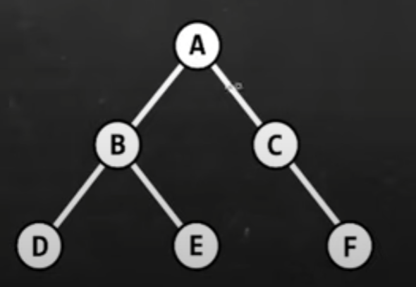

# Tree
a tree is a non-linear data structure where nodes are organized in a hierachy
(example could be a family tree)

### it is used in
File explorer
 
Databases
 
DNS
 
HTML DOM
 
 
The top of the tree is known as the root
 
The nodes at the bottom are the leafs
 
Nodes in the middle are branches
 

### in family terms:
The top is the parent
 
In the middle there is the parent/child
 
at the bottom there is the child
 
When nodes share the same parent, they are siblings

### subtrees is a smaller tree held within a larger tree

## Some terms:
### size = # of nodes

### depth = # of edges below the root node

### height = # of edges above furthest leaf node

